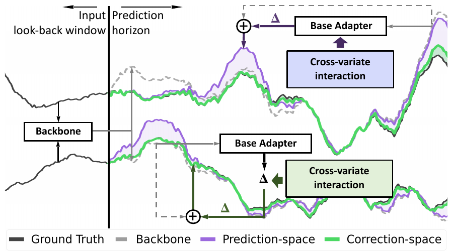
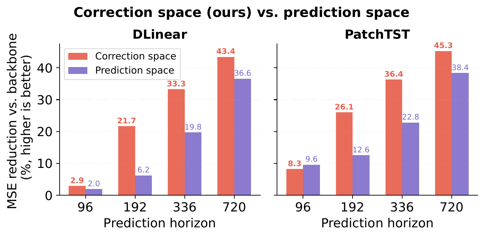

# CoRe: Correction-space Cross-variate Interaction for Test-time Adaptation in Time Series Forecasting

Official implementation of **CoRe (Correction-space Interaction Refinement)**.

**Paper:** [arXiv:2609.34638](https://arxiv.org/abs/2609.34638)

CoRe studies **where cross-variate interaction should take place** in test-time adaptation. Rather than mixing backbone predictions, it performs interaction in the **correction space**, avoiding direct mixing of uncorrected backbone errors across variates. We demonstrate this principle through a simple, parameter-efficient implementation.

Across seven backbones, six datasets, and four prediction horizons, **CoRe reduces MSE by 25.82% on average over frozen backbones and by 10.57% over COSA**, with stronger gains at medium-to-long horizons and modest computational overhead.

## Overview



## Why Correction Space?



## Setup

Install the dependencies listed in `requirements.txt` in a compatible Python/PyTorch environment with CUDA support.

```bash
pip install -r requirements.txt
```

Prepare the datasets under `./data/` and place a pretrained backbone checkpoint at:

```text
./checkpoints/<BACKBONE>/<DATASET>_<HORIZON>/checkpoint_best.pth
```

## Run CoRe

Example: DLinear on Exchange Rate, prediction horizon 720.

```bash
python main.py \
  DATA.NAME exchange_rate \
  DATA.PRED_LEN 720 \
  MODEL.NAME DLinear \
  MODEL.pred_len 720 \
  TRAIN.ENABLE False \
  TRAIN.CHECKPOINT_DIR ./checkpoints/DLinear/exchange_rate_720/ \
  TTA.ENABLE True \
  RESULT_DIR results/CORE/ \
  TTA.COSA.STEPS 20 \
  TTA.CORE.GATE_BIAS_INIT -1.0
```

### Train a backbone

If a pretrained checkpoint is not available, train the corresponding backbone first:

```bash
python main.py \
  DATA.NAME ETTh1 \
  DATA.PRED_LEN 96 \
  MODEL.NAME DLinear \
  TRAIN.ENABLE True \
  TRAIN.CHECKPOINT_DIR ./checkpoints/DLinear/ETTh1_96/
```

Then run CoRe using the same dataset, backbone, horizon, and checkpoint directory:

```bash
python main.py \
  DATA.NAME ETTh1 \
  DATA.PRED_LEN 96 \
  MODEL.NAME DLinear \
  MODEL.pred_len 96 \
  TRAIN.ENABLE False \
  TRAIN.CHECKPOINT_DIR ./checkpoints/DLinear/ETTh1_96/ \
  TTA.ENABLE True \
  RESULT_DIR results/CORE/ \
  TTA.COSA.STEPS 20 \
  TTA.CORE.GATE_BIAS_INIT -1.0
```

The result directory is extended with the checkpoint-directory suffix by `main.py`.

## Configuration

CoRe reuses the **base-adapter settings under `TTA.COSA`**, while CoRe-specific SCR settings are under `TTA.CORE`.

| Setting | Default | Meaning |
| --- | --- | --- |
| `DATA.SEQ_LEN` | `96` | Lookback length |
| `TTA.COSA.STEPS` | `20` | Adaptation steps |
| `TTA.COSA.BATCH_SIZE` | `25` | Adaptation batch size |
| `TTA.COSA.BUFFER_CONTEXT_SIZE` | `5` | Base-adapter context size |
| `TTA.COSA.VAR_WISE_GATING` | `True` | Variate-wise base-adapter gating |
| `TTA.CORE.GATE_BIAS_INIT` | `-1.0` | Initial bias of the spectral gate |

The SCR bottleneck defaults to rank `r = C` (number of variates). The implementation also reads an optional `TTA.CORE.SCR_RANK_MULT` value through `getattr`; its default is `1.0`. For high-dimensional datasets, consult the paper's fixed-rank experiments before changing the configuration.

## Experiments

The main paper evaluates **seven backbones** (DLinear, FreTS, OLS, PatchTST, iTransformer, MICN, Informer), **six datasets** (ETTh1, ETTh2, ETTm1, ETTm2, Weather, Exchange Rate), and prediction horizons `96`, `192`, `336`, and `720`. Electricity and Traffic are additionally used for scalability experiments.

The benchmark datasets (ETT, Weather, Exchange Rate, Electricity, and Traffic) can be downloaded from the [Google Drive dataset collection](https://drive.google.com/drive/folders/13Cg1KYOlzM5C7K8gK8NfC-F3EYxkM3D2?usp=sharing) linked by [Time-Series-Library](https://github.com/thuml/Time-Series-Library). Place the downloaded files under `./data/` following the layout expected by `datasets/build.py`. The paper specifies the evaluation protocol and full results.

### Baselines

The repository also includes baseline implementations. The adapter is selected by the `RESULT_DIR` prefix in `main.py` (for example `COSA`, `PETSA`, `DYNATTA`, or `TAFAS`). Use the same pretrained checkpoint and experimental protocol for comparisons.

## Code provenance and licensing

This repository builds upon [TAFAS](https://github.com/kimanki/TAFAS), which identifies its license as **Modified MIT License (Non-Commercial with Permission)**. It also includes implementations of other test-time adaptation baselines. Please review the original projects' licenses and permission requirements before reusing or redistributing third-party code. A repository-wide license for the combined codebase is not asserted here.

## Citation

If you find this work useful, please consider citing our paper:

```bibtex
@misc{deng2026correctionspacecrossvariateinteractiontesttime,
      title={Correction-space Cross-variate Interaction for Test-time Adaptation in Time Series Forecasting}, 
      author={Yuanyuan Deng and Mykola Pechenizkiy and Songgaojun Deng},
      year={2026},
      eprint={2609.34638},
      archivePrefix={arXiv},
      primaryClass={cs.LG},
      url={https://arxiv.org/abs/2609.34638}, 
}
```
